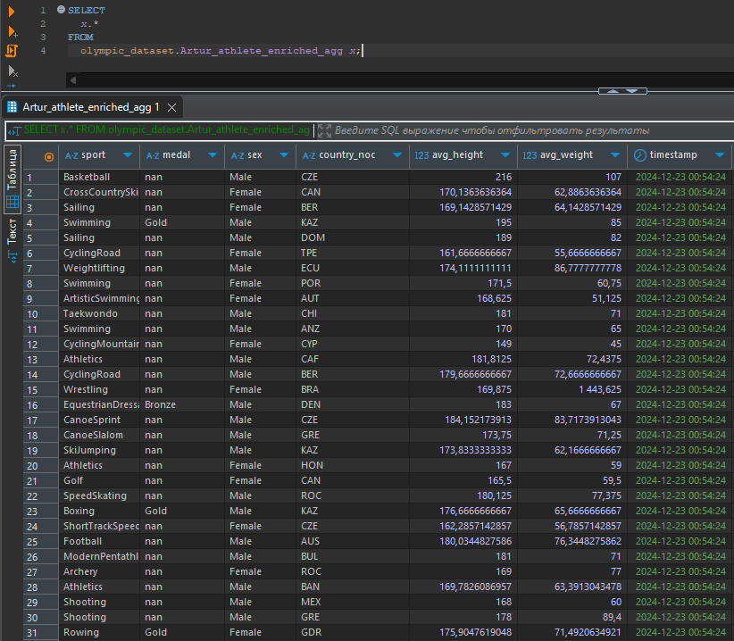
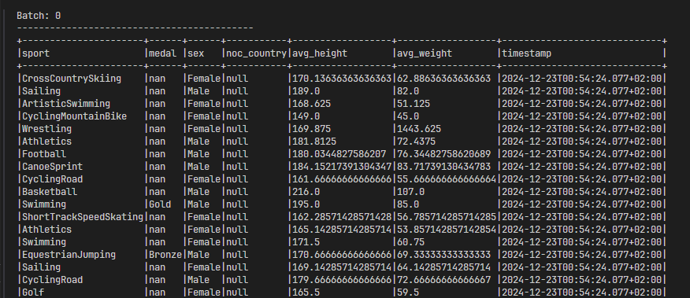
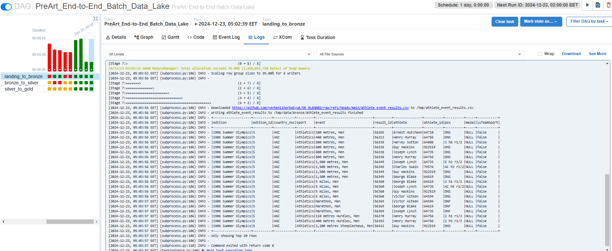
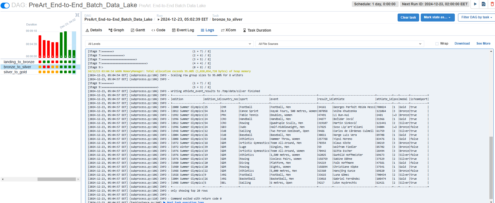
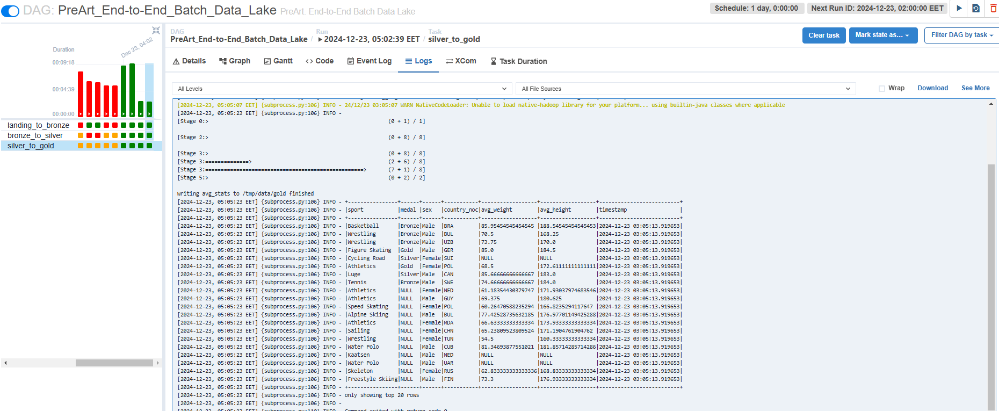
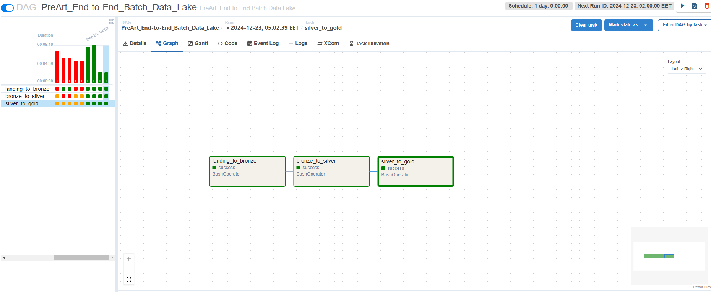

# Фінальний проєкт з курсу

## Частина 1. Building an End-to-End Streaming Pipeline

### Покрокова інструкція виконання

Ви працюєте в букмекерській конторі. Одне з ваших завдань — генерація даних для ML-моделей. Деякі з features — це середній зріст, середня вага, стать, країна походження атлетів.

Моделі тренуються окремо для кожного виду спорту. Дані про наявність медалі у виступі використовуються як target (output) для ML-моделі.

Фірма хоче коригувати коефіцієнти ставок якомога швидше, тому вас попросили розробити відповідне рішення з використанням стримінгу. Фізичні дані атлетів відомі заздалегідь і зберігаються в MySQL базі даних. Результати змагань же подаються через Kafka-топік.

Ваша задача:

1. Зчитати дані фізичних показників атлетів за допомогою Spark з MySQL таблиці `olympic_dataset.athlete_bio` (база даних і Credentials до неї вам будуть надані).

2. Відфільтрувати дані, де показники зросту та ваги є порожніми або не є числами. Можна це зробити на будь-якому етапі вашої програми.

3. Зчитати дані з mysql таблиці `athlete_event_results `і записати в кафка топік `athlete_event_results`. Зчитати дані з результатами змагань з Kafka-топіку `athlete_event_results`. Дані з json-формату необхідно перевести в dataframe-формат, де кожне поле json є окремою колонкою.

4. Об’єднати дані з результатами змагань з Kafka-топіку з біологічними даними з MySQL таблиці за допомогою ключа `athlete_id`.

5. Знайти середній зріст і вагу атлетів індивідуально для кожного виду спорту, типу медалі або її відсутності, статі, країни (`country_noc`). Додайте також timestamp, коли розрахунки були зроблені.

6. Зробіть стрим даних (за допомогою функції `forEachBatch`) у:

а) вихідний кафка-топік,

b) базу даних.

## Частина 1. Рішення

0. Створення Kafka-топіків:  
   [p1_0_create_topic.py](p1_0_create_topic.py)

1. Завдання 1-6:  
   [p1_1_data_processor](p1_1_data_processor.py)  
   Скрин таблиці в базі даних з розрахованими середніми значеннями
     
   Скрин даних з Kafa-топіку  
   

## Частина 2. Building an End-to-End Batch Data Lake

Файли перетворень:

1. [landing_to_bronze.py](dags/landing_to_bronze.py)
2. [bronze_to_silver.py](dags/bronze_to_silver.py)
3. [silver_to_gold.py](dags/silver_to_gold.py)

Airflow DAG, який послідовно запускає перетворення:

- [project_solution.py](dags/project_solution.py)

Скрини фінальних DataFrame для кожної Spark job:

Скрин графу відпрацьованого DAGу  

